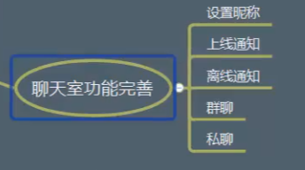

### 聊天室功能完善

#### 上线通知

+ client
client.emit('server.online',nickname)
client.on('client.online')

+ server
socket.on('server.online',nickname=>{
socket.nickname=nickname
io.emit('client.online',nickname)// broadcast也行

})

#### 离线通知
+ server
socket.on('disconnect',()=>{
    socket.emit('client.offline',socket.nickname)
})
+ client
client.on('client.offline')

#### base64图片传输
粘贴图片
通过canvas:远程文件
通过fileReader本地文件

将图片转为base64传输
paste事件

#### binary数据传输
客户端昵称设置，在线列表更新

#### 数据管理
用户信息，聊天记录，聊天文件
聊天消息和文件缓存
#### 用户体系
#### 权限系统
#### 多用户系统稳定性
socket可能只适合几个人或者几百个人并发
#### socketio命名空间划分 
.to,io.of,join,leave
#### qq群实现原理
新建一个群---创建一个房间，生成房间号
用户上线时，遍历用户参与的群，将用户添加到这些房间中，有群消息就能收到通知

#### 消息推送
web广播；服务器不定时向客户端推送信息
方式：
http：轮询，长连接，websocket
XMPP：
SMS拦截
MQTT
#### MQTT
发布订阅
mosca:MQTT server
不具备集群功能，需要借助第三方库，redis,mongo,rabbitmq,zeromq

ready;error;clientConnected;clientDisconnected
published,subscribe,取消订阅

