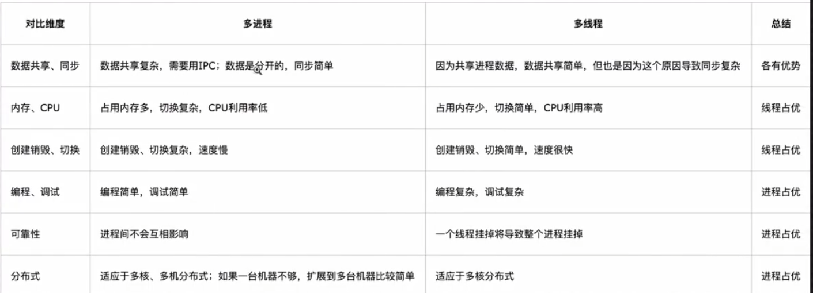
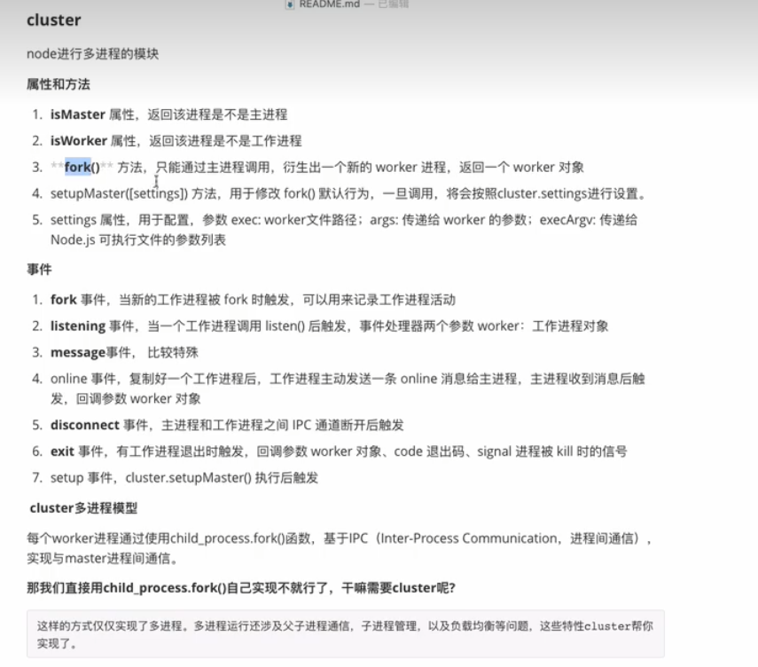

### 多线程和多进程
浏览器一个tab就是一个进程，node中一个http服务就是一个进程
进程中可以有多个线程，多个线程共享这个进程的资源，线程有独立的栈和变量
### 选择
1. 需要频繁创建销毁的优先使用线程
来一个连接，建立一个线程
2. 进行大量计算，优先线程
图像处理，算法处理
3. 强相关处理，使用线程，弱相关使用进程
一般的server需要完成：消息收发，消息处理，收发和处理是弱相关任务，而消息处理里面
分消息解码，业务处理，相关性强；消息收发和消息处理可分为进程设计；消息解码和业务处理
可分为线程设计
4. 可能要扩展到多机分布使用进程，多核分布用线程
5. 都满足需求，则使用熟悉的

线程快，进程可靠

### 多进程
+ 利用cluster创建

